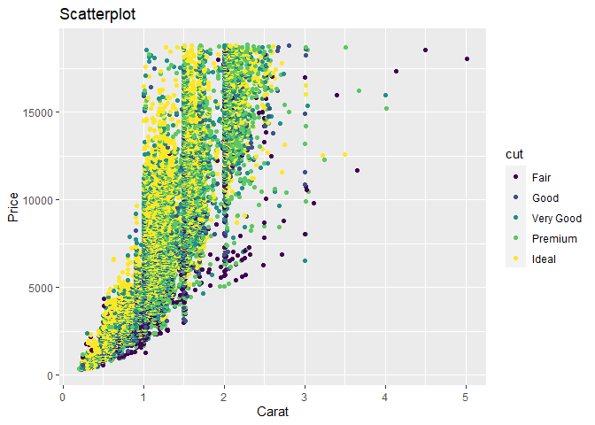

Programming Background
================
2023-06-09

Note: this is for setup

``` r
knitr::opts_chunk$set(fig.path = "../images/")
```

\##Programming Experience in R and Beyond

*Everyone in this course had some programming experience coming in (due
to the prerequisites). What are your thoughts on R vs whatever other
software you’ve used? What functionality do you like about R? What parts
do you miss about your other language? Do you consider R a difficult
language to learn? (If you knew R prior to the course, describe your
experience when first learning it.)* Answer: R is similar to other
software I’ve used such as Python (and specifically, it behaves pretty
similarly to the pandas package in python). Like pandas, I love how easy
it is to get statistics, analyses and plots/figures, without needing to
create a billion four loops. I also like how stable it is. R is not at
all a difficult language to learn; in fact, I had zero programming
experience when I took my second intro to stats course which exclusively
used R. We also used R almost exclusively when I was a statistics major
in undergrad. During my intro course, it was kind of intimidating
because I had no idea what some of the things were (what is a terminal?
what’s markdown? and so on) but it was so functional and user-friendly
that it didn’t really matter.

\##Example R Markdown Output Here’s an example of how easy it is to
create visualizations in R. For example, you can get some pretty
sophisticated graphs using packages like ggplot2.

``` r
library(ggplot2)
gg <- ggplot(diamonds, aes(x=carat, y=price, color=cut)) + geom_point() + labs(title="Scatterplot", x="Carat", y="Price")
print(gg)
```

<!-- -->
